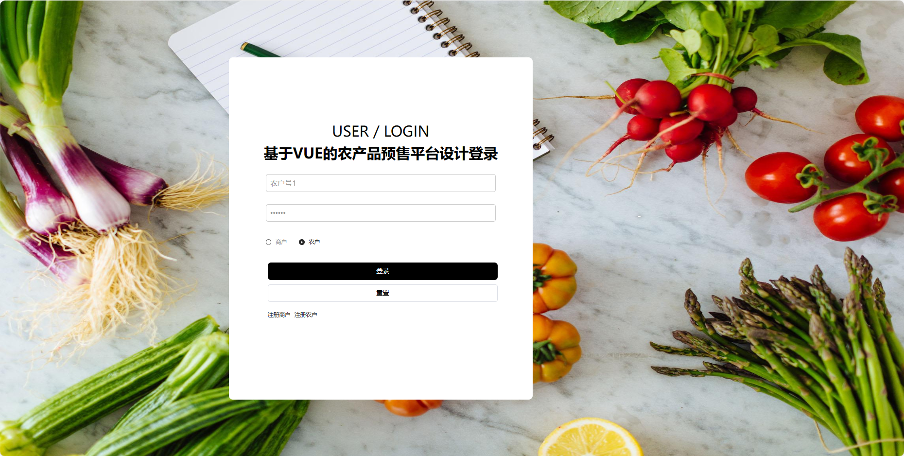
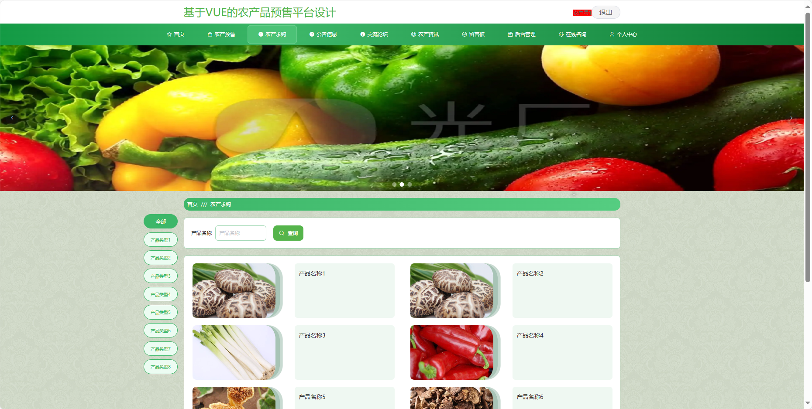
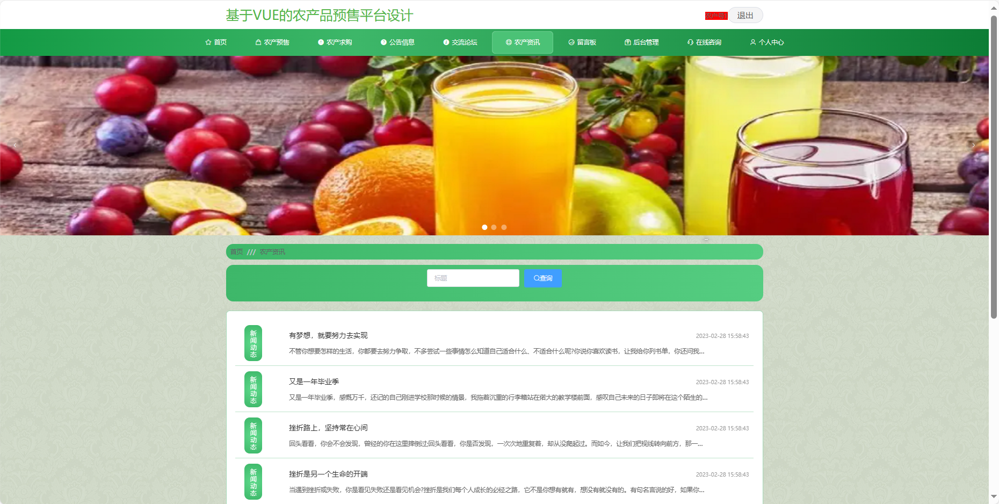
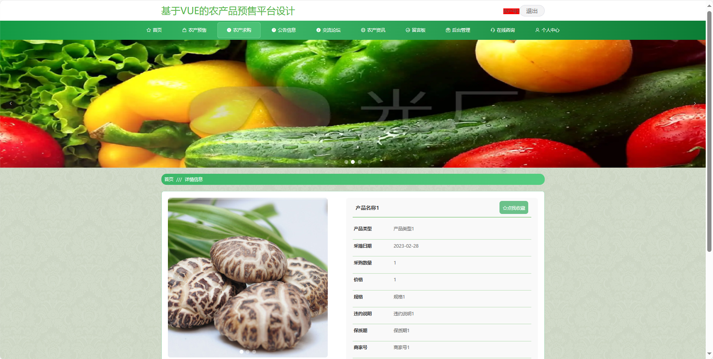
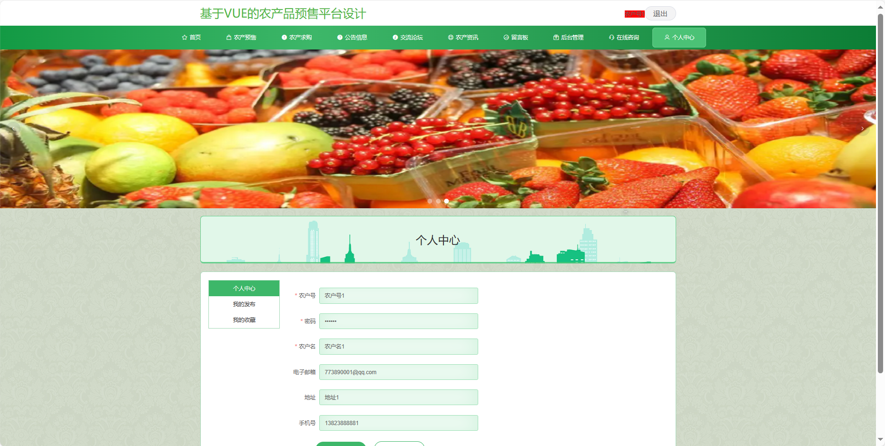
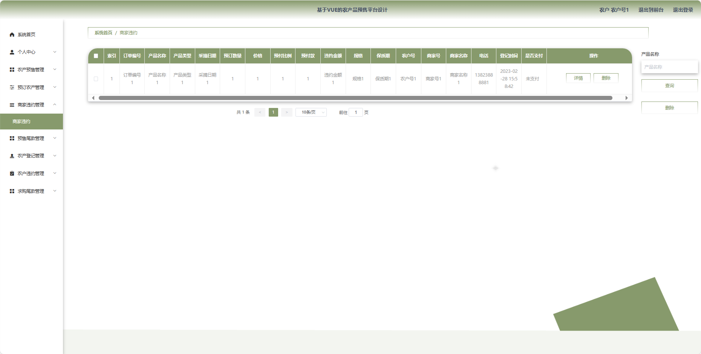
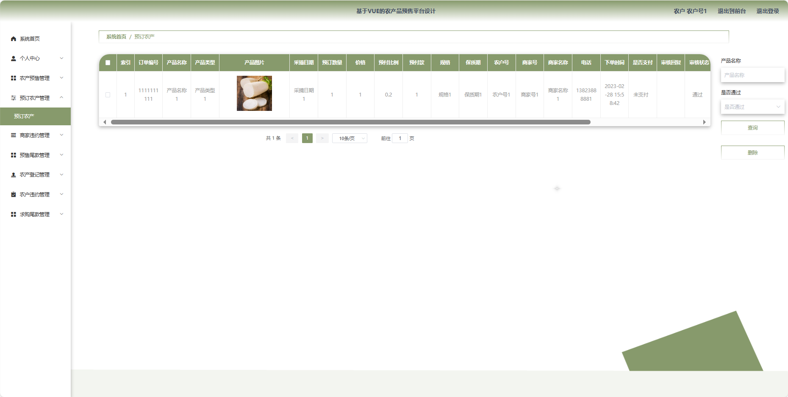
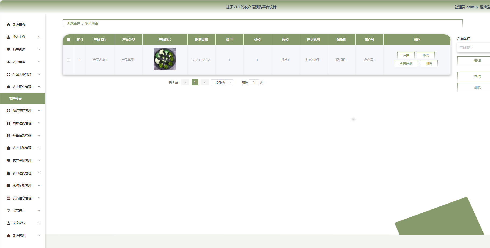
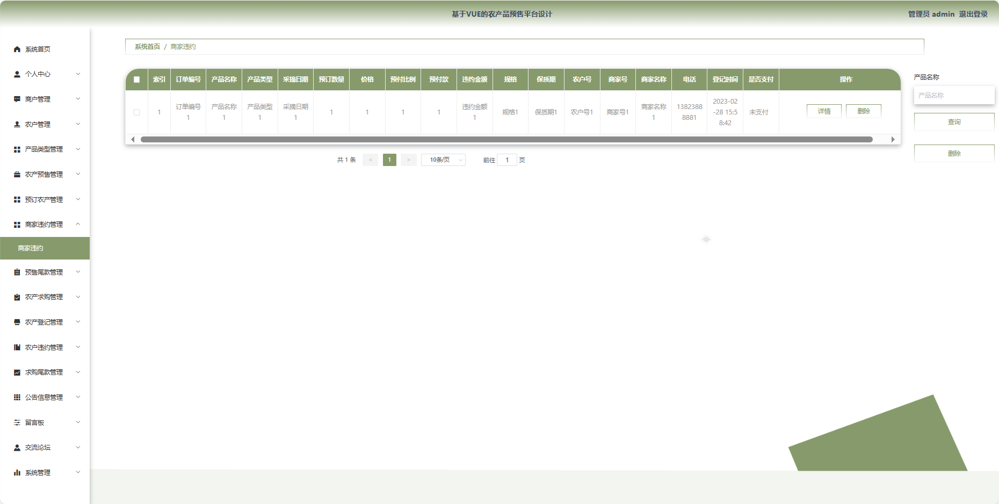

## 基于VUE的农产品预售平台

###  获取sql数据库文件: 从戎源码网 (https://armycodes.com/) QQ: 386869957 QQ群: 377586148
###  所有系统地址: (https://github.com/YuLin-Coder/AllProjectCatalog) 
###  所有项目以及源代码本人均调试运行无问题 可支持远程安装部署调试、定制修改、代码讲解

## 项目介绍
基于VUE的农产品预售平台，系统包含三种角色：管理员、农民,商家主要功能如下。

### 【管理员】:
系统首页：查看平台整体概况。
个人中心：管理个人信息。
商户管理：管理注册商家的基本信息。
农户管理：管理注册农民的基本信息。
产品类型管理：管理农产品的分类信息。
农产预售管理：监管和管理农产预售信息。
预订农产管理：处理用户对农产品的预订请求。
商家违约管理：处理商家涉及的违约情况。
预售尾款管理：管理用户对预售农产品的尾款支付。
农产求购管理：监管和管理农产求购信息。
农产登记管理：审核和管理农产品的登记信息。
农户违约管理：处理农户涉及的违约情况。
求购尾款管理：管理用户对求购农产品的尾款支付。
公告信息管理：发布、编辑和删除平台公告。
留言板：查看和管理用户在留言板上的留言。
交流论坛：监管和管理交流论坛的内容。
系统管理：管理系统的基本设置和运行参数。

### 【农民】:
首页：展示平台的基本信息。
农产预售：发布农产品预售信息。
农产求购：发布对特定农产品的求购需求。
公告信息：查看平台发布的相关公告和通知。
交流论坛：参与用户间的交流和讨论。
农产资讯：浏览与农业相关的新闻和资讯。
留言板：留下对特定信息或农产品的留言。
后台管理：管理个人发布的信息编辑、删除等操作。
在线咨询：与平台管理员进行在线沟通和咨询。
个人中心：管理个人信息、发布的信息记录等。

### 【商家】:
首页：展示平台的基本信息。
农产预售：发布农产品预售信息，。
农产求购：发布对特定农产品的求购需求。
公告信息：查看平台发布的相关公告和通知。
交流论坛：参与用户间的交流和讨论。
农产资讯：浏览与农业相关的新闻和资讯。
留言板：留下对特定信息或农产品的留言。
后台管理：管理个人发布的信息，编辑、删除等操作。
在线咨询：与平台管理员进行在线沟通和咨询。
个人中心：管理个人信息、发布的信息记录等。

## 项目技术
- 编程语言：Java
- 数据库：MySQL
- 项目管理工具：Maven
- 前端技术：HTML、CSS、JavaScript、Vue
- 后端技术：Spring、SpringMVC、MyBatis

## 运行环境
- JDK版本：JDK1.8及以上
- 开发工具：IDEA、Ecplise、Myecplise都可以
- 数据库: MySQL5.7及以上
- Maven：maven3.0及以上
- Node：14.14.0及以上

## 运行截图

